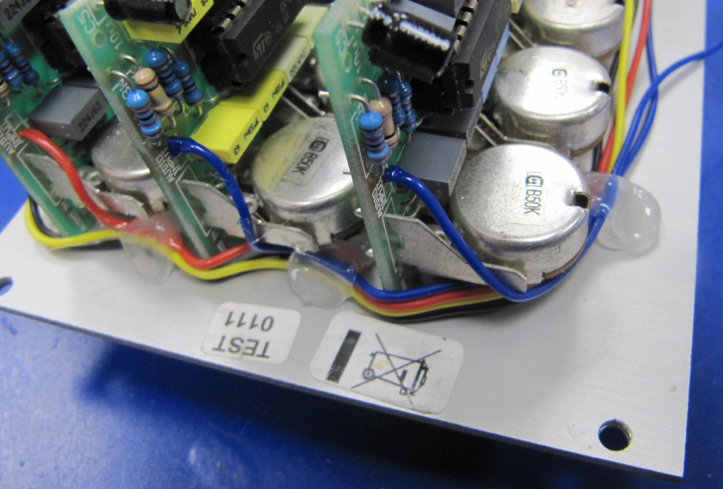
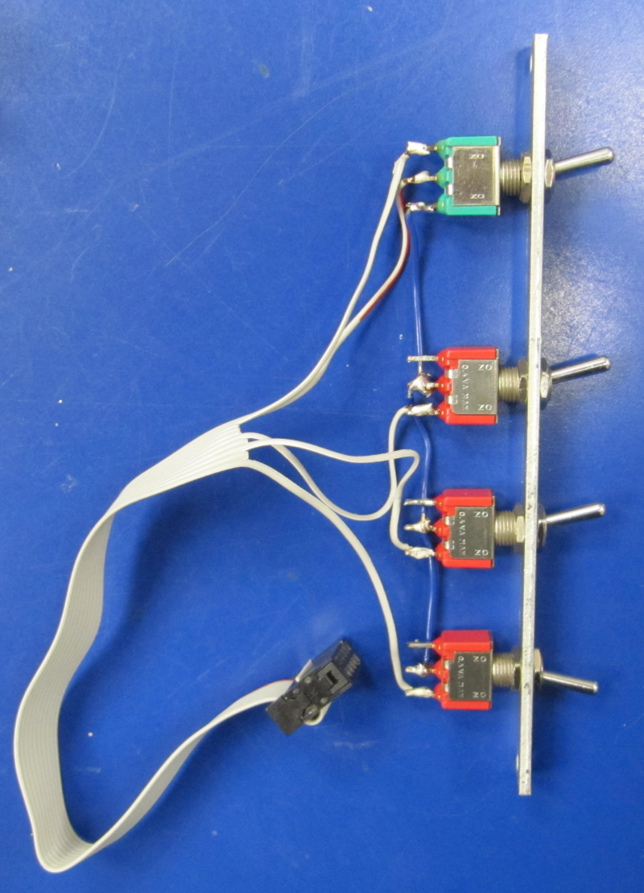

# Doepfer A-128 fixed filter bank MOD
Extending the Doepfer A-128 fixed filter bank eurorack module with 4 bypass switches.

## Who is it for?

If you are the owner of a [Doepfer A-128 fixed filter bank](https://doepfer.de/a128.htm) this project might be useful for you.  

With a few bucks for material and 1 hour of work you can create an extension module that adds bypass functionality to your filter bank.  

## What does it do?
 - **Switch 1:** bypass the whole filter module and send the incoming signal directly to the output
 - **Switch 2:** mute all **high** frequencies (greater ~1500 Hz)
 - **Switch 3:** mute all **mid** frequencies (~200 - 1500 Hz)
 - **Switch 4:** mute all **low** frequencies (below ~200 Hz)

## Will my filter bank still be functional without the extension module after modding?
Yes, simply place 4 jumpers in the breakout connector. The signal flow will be exactly the same like without the mod.

 

# Step by step build instructions

## 1. Desolder audio input wire that connects the 3 PCB's
Find and desolder the wire on the upper half of the module that connects the 3 PCB's with label `AUDIO INPUT`.  

## 2. Modifications on PCB1 (low frequencies)
Drill a `1.5mm` hole into **left PCB** (with in-/output jacks and potentiometers for low frequencies) where you desoldered the `AUDIO INPUT` wire.  
Ensure that there is **no connectivity** between the pins shown in the picture below.     

  

Solder 2 wires into the connection points next to the drilled hole.  
I used a `red wire` for `AUDIO INPUT` which has connectivity to the tip of the input jack and a `black wire` which is the audio input for the low frequencies circuit.  

Solder another wire next to the `OUTPUT`-jack.  

## 3. Modifications on PCB2 + PCB3 (mid + high frequencies)
Solder 2 wires into the holes where you removed the `AUDIO INPUT` connection wire in **step 1** on PCB2 and PCB3  

## 4. Ensure the additional cables stay in place
Hot glue is your friend  

## 5. Solder other end of cables to a 10 pin box header
Further you have to connect the 4 pins.  
*TODO: add picture with circuit schematics of box header*  

## 6. Ensure the box header stays in place
Hot glue is your friend - again  

## 7. create cable and front panel

  - Create a `2HP` aluminium front panel `128.5mm` x `9.8mm` x `2mm` or use a [blank panel Doepfer A-100 B2](https://doepfer.de/a100z_e.htm#blind%20panels)
  - drill 4 holes for the switches
  - mount the 4 switches
  - solder the cables to the switches  

*TODO: add circuit schematics for the switches*  

  

[**Doepfer Filter Bank Bypass Breakout** on modulargrid.net](https://www.modulargrid.net/e/other-unknown-a-128-bypass-breakout)

see my other [eurorack DIY projects](https://github.com/othmar52/eurorack)
